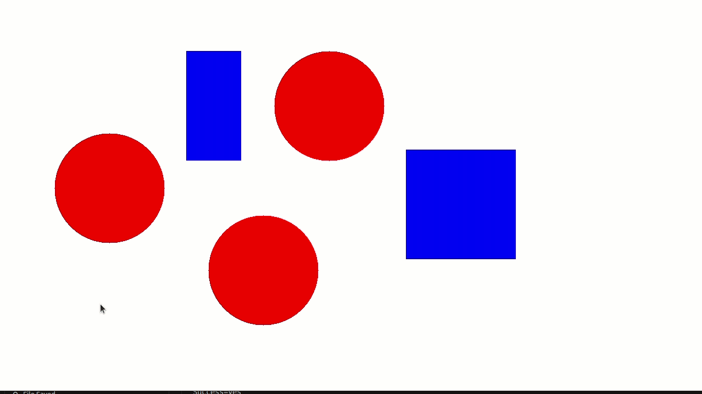

This is a project based on ZJU Fast lab's ego_planner.
# How to use
Go to sourse file folder, and in a terminal you can compile and run:

``` Bash
mkdir build
cd build
cmake ..
make
./optimize_test
```

Then you will see a window, and you can use listed operation of mouse:
- left button: choose start point
- right button: choose goal point
- middle button: clear start and goal point

# Demo
You can see planning result in follow gif:
